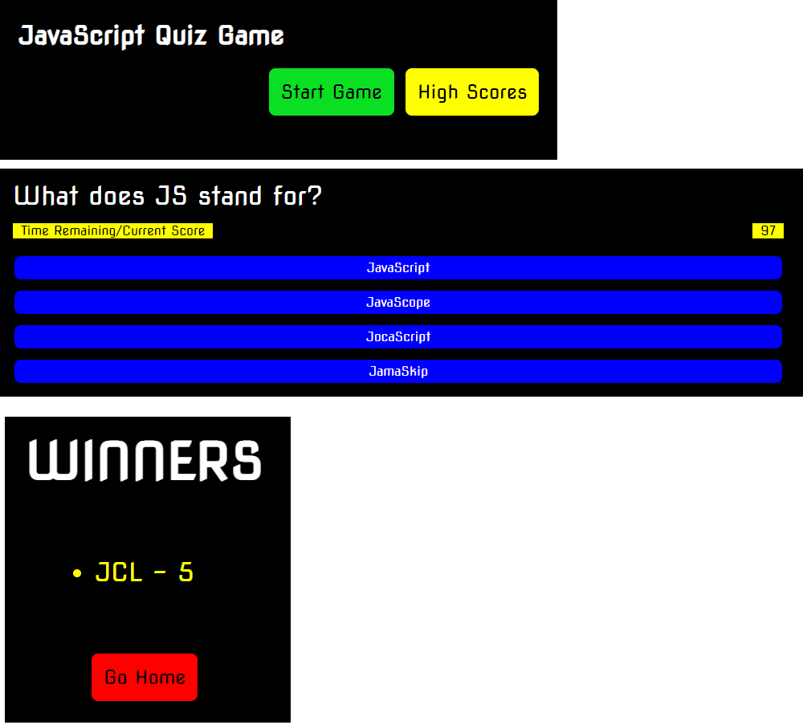

# 04-JSS-Quiz-Game

## Challenge User Story
AS A coding boot camp student
I WANT to take a timed quiz on JavaScript fundamentals that stores high scores
SO THAT I can gauge my progress compared to my peers

## Challenge Acceptance Criteria
GIVEN I am taking a code quiz
WHEN I click the start button
THEN a timer starts and I am presented with a question
WHEN I answer a question
THEN I am presented with another question
WHEN I answer a question incorrectly
THEN time is subtracted from the clock
WHEN all questions are answered or the timer reaches 0
THEN the game is over
WHEN the game is over
THEN I can save my initials and my score

## My Goal
I will create a quiz game web application using html, css, and js. This app will run in the browser and will feature dynamically updated HTML and CSS powered by JavaScript code. It will have a clean and polished appearance, and meet the above requirements.

## Grading Requirements
This challenge is graded based on the following criteria:

### Technical Acceptance Crtieria:
* Application satisfies the above criteria.

### Deployment:
* Application deployed at live URL.

* Application loads with no errors.

* Application GitHub URL submitted.

* GitHub repository that contains application code.

### Application Quality:

* Application user experience is intuitive and easy to navigate.

* Application user interface style is clean and polished.

* Application resembles the mock-up functionality provided in the Challenge instructions.

### Repository Quality: 

* Repository has a unique name.

* Repository follows best practices for file structure and naming conventions.

* Repository follows best practices for class/id naming conventions, indentation, quality comments, etc.

* Repository contains multiple descriptive commit messages.

* Repository contains quality readme file with description, screenshot, and link to deployed application.

## Review

Submit the following for review:

* The URL of the deployed application.

* The URL of the GitHub repository, with a unique name and a README that describes the project.

## Application Screenshot

The following image shows the web application's appearance and functionality:

## Application Link

The following is a link to the deployed application in GitHub pages.

[James Li Challenge 03: JavaScript](https://jimjamlee.github.io/04-JSS-Quiz-Game/)